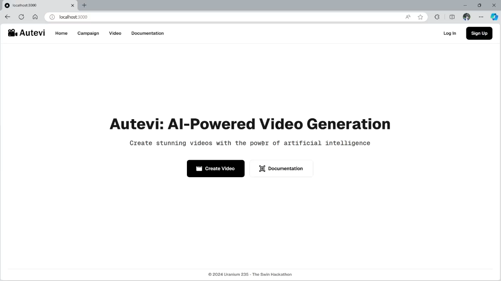
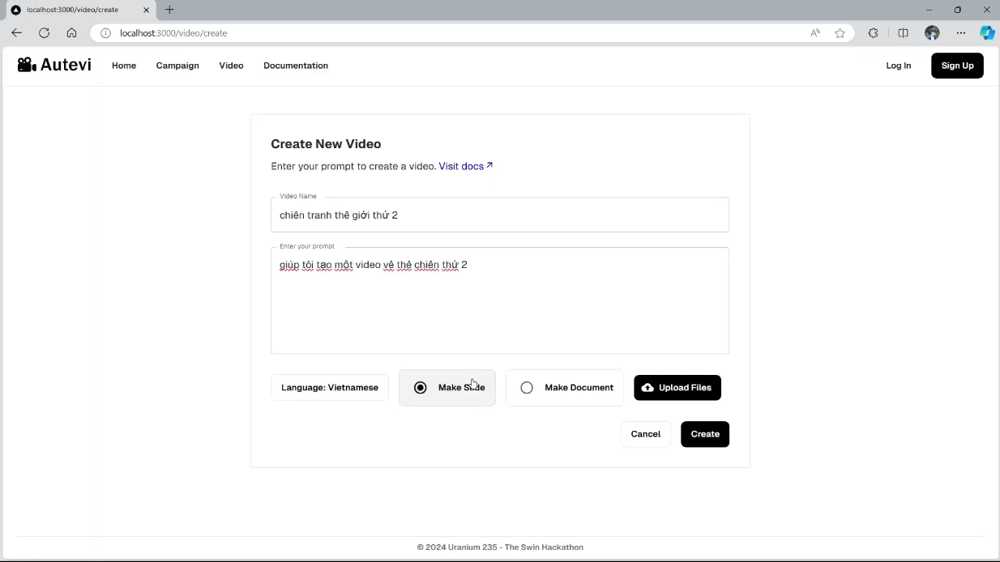
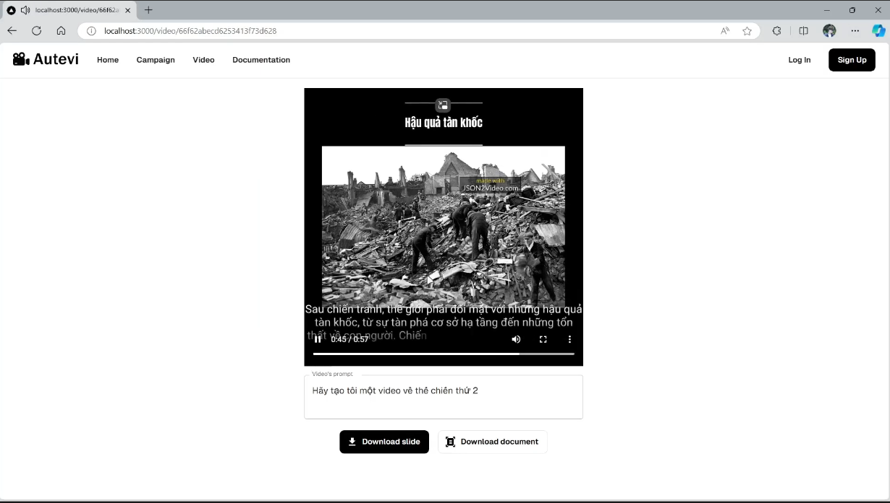

# AuTeVi - Automatic Text to Video for multimedia distribution

A powerful solution, driven by LLMs and a Multi-Agent System, designed to automate the creation of videos, presentations, and documents for various use cases.


## Advantages

- Automated Content Generation: Create exceptional contents for content makers just by some clicks.

- Quality Assurance: Ensure the quality of the contents and products with our well-designed flow containing best AI agents.

- Cost-Effective Productions: Reduce operational costs by automating production tasks, eliminating the need for manual content creation, and streamlining processes.

- Analysis and Feedback : Leverage data-driven insights to refine and improve content through continuous analysis and feedback loops.

- Easy editing: Customize and modify outcomes seamlessly, allowing you to tailor content to your specific needs with minimal effort.

## Installation

It's easy to install this project by the following commands (ensure that you have docker):
```
git clone https://github.com/hoangbros03/AuTeVi.git
cd AuTeVi
# Now we have 3 folder: frontend, backend, ai

# Create mongo as DB
# There are other ways, but using Docker is the simplest way
docker run --name mongodb -d -p 27017:27017 mongo

# Run backend with java spring boot
./mvnw spring-boot:run

# Run AI component
cd ../ai
pip install -r requirements.txt
pip install -e .
fastapi dev src/main.py --port 6969

# Run frontend run with next.js
cd ../frontend
npm install
npm run dev
```
Then we can start by go to `localhost:3000`

## Environment Variables

Please note that due to an extremely limited time, we now store the api keys on a file inside AI component. Please change if needed. The API keys are:

```
JSON2VIDEO_API = 'XXXXX' # To convert JSON to video
TAVILY_API = 'XXXXX' # To search images & information
GEMINI_API = 'XXXXX' # To call the LLM
IMGBB_API='XXXXX' # To upload image online
DB_LINK = 'XXXXX' # Link to MongoDB
EMBED_MODEL_ID = 'XXXXX' # To use RAG powered with AWS Bedrock
```


## Demo




## Acknowledgements

This quick prototype was developed during the 24-hour coding session of the Swin Hackathon 2024. We aimed to create a functional, feasible, and visually appealing prototype. A big thanks to our teammates and the organizers!
